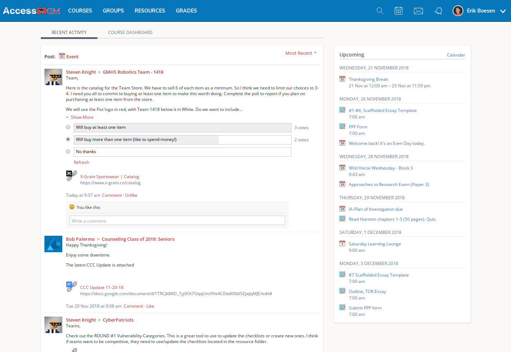
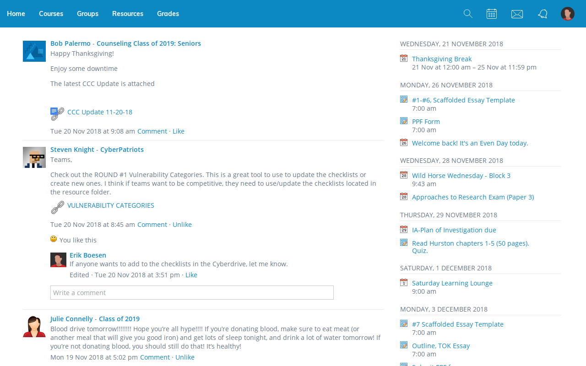

# Newlogy

Newlogy enhances the [Schoology](https://schoology.com) Learning Management System interface by cleaning up graphical styling, hiding some unnecessary user interface elements, and adding new useful features.

[Install from the Chrome Web Store](https://chrome.google.com/webstore/detail/newlogy/bjcabjilfhmoahlpkffklacegnndmbbb)

If on another browser, simply sideload this extension in developer mode.

### Before

### After

Please open an issue if you notice any inconsistencies or opportunities to improve the Schoology interface!

## Goals
* Unify design
* Remove extraneous and redundant UI elements
* Simplify design language

## Changes
* Replace school logo with a simple "Home" link because we haven't even used Access since fourth grade
* Remove useless homepage "RECENT ACTIVITY" and "COURSE DASHBOARD" tabs
* Display course and group menus as a list, not as a clunky grid
* Remove course "academic year" label because you know what year it is
* Use normal capitalization for header tabs to match the rest of the interface and because the word "grades" is already frightening enough in lowercase
* Disable school-colored links, which are used unevenly and clash with the traditional blue color scheme
* Use fewer shades of grey for text
* Style buttons in a similar way
* Replace bizarre smiley faces next to like buttons with thumbs up emoji
* Automatically load posts as you scroll
* Add flag emoji next to language selection, because reasons
* Remove logged-in user's name from header because you probably don't need to be reminded who you are
* Several hundred other graphical tweaks

## License
[MIT](LICENSE)
## Author
Developed by [Erik Boesen](https://github.com/ErikBoesen) at George Mason High School.
